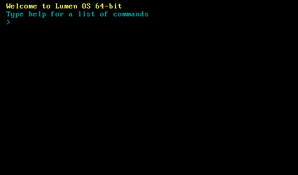

Lumen OS is an free, open source operating system created by the Quantam Glyph Studios The OS is open source for now.How to build & run

To build Lumen, you need to either be running Linux, or Windows with WSL (Windows Subsystem for Linux).

Steps to build Lumen:
  1. qemu-img create -f raw hdd.img 64M - This creates a virtual disk to run the Lumen OS
  2. make
  3. make build-x86_64
  4. qemu-system-x86_64 -drive file=hdd.img,format=raw -drive file=dist/x86_64/kernel.iso,media=cdrom

If you are using docker like me then the steps are different

> [!WARNING]
> Proceed with caution.
> Any damages caused to you device will not be taken by us.

Startup Screen:

The random number guessing game:
